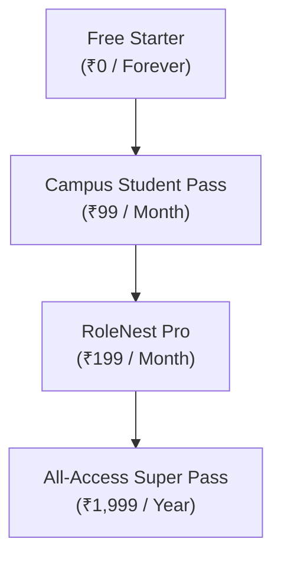
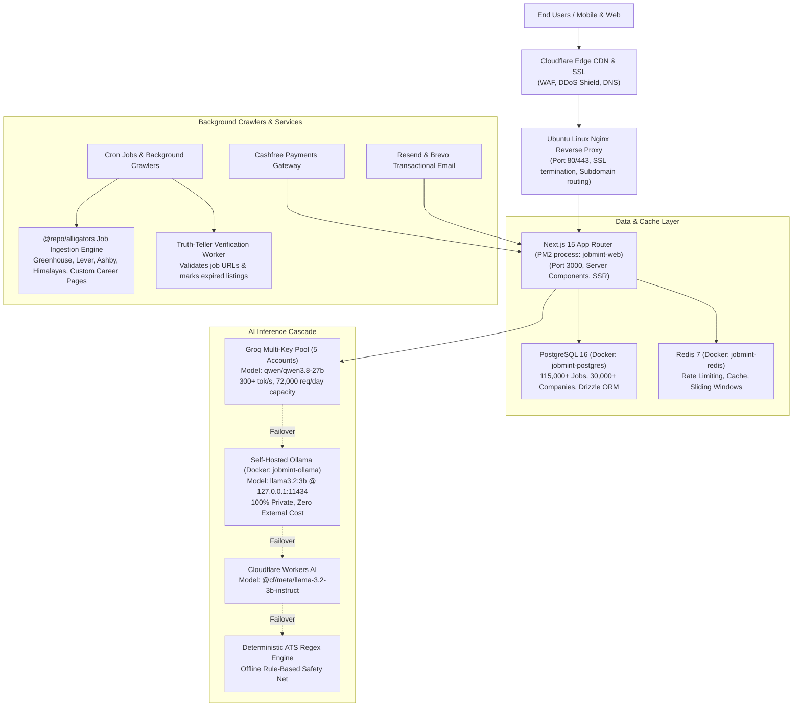

# RoleNest Ecosystem — Master Architecture & Platform Specification

> **Version:** 2.4.0 Production Specification  
> **Primary Domain:** [rolenest.in](https://rolenest.in)  
> **Last Updated:** October 2026  
> **Status:** Live & Production Ready  

---

## 1. Executive Summary & Platform Mission

**RoleNest** (formerly JobMint / RitualDev Lab) is an end-to-end, zero-ghosting career infrastructure and engineering acceleration platform designed specifically for tech talent, students, and engineers in India and remote worldwide ecosystems.

### The Core Problem RoleNest Solves:
1. **Recruiter Ghosting & Third-Party Trap**: Job seekers spend hours filling out third-party consultancy forms or aggregator scrapers that harvest user data without official company links. RoleNest provides **100% direct official ATS application links** (Greenhouse, Lever, Ashby, Workday, BambooHR, SmartRecruiters) and runs a daily automated Crawler Engine that verifies whether a job is still active or expired.
2. **Unrealistic AI Pricing & Compute Depletion**: Many platforms promise "infinite AI" that drains server budgets or gets accounts suspended by third-party providers. RoleNest uses an intelligent **5-account Groq API Pool (`qwen/qwen3.8-27b`)** with a sub-millisecond local **Self-Hosted Ollama (`llama3.2:3b`)** fallback on private infrastructure, strictly metered by realistic plan allowances.
3. **Fragmented Learning & Job Hunting**: Engineers typically use LeetCode for DSA, roadmap.sh for guides, YouTube for tutorials, and LinkedIn for jobs. RoleNest unites everything into a cohesive ecosystem across specialized subdomains: **RoleNest** (Jobs & ATS), **ProblemNest** (DSA Coding Arena & Monaco runner), and **StudyNest** (Visual Roadmaps, Skill Canvas, 30-Day Cohorts & Verified Certificates).

---

## 2. Multi-Domain & Subdomain Architecture

The platform operates across specialized subdomains, unified under a single Next.js 15 App Router architecture with custom edge middleware routing ([`apps/web/middleware.ts`](file:///D:/jobapp/apps/web/middleware.ts)) and optimized Nginx reverse proxies on Ubuntu Linux:

| Subdomain | Primary Purpose | Route Rewritten In Next.js | Key UI & Layout Experience |
|:---|:---|:---|:---|
| **`rolenest.in`** | Primary Portal & Core Job Search Engine | `/` (root) | Main RoleNest Navbar, ATS tools, Job listings, Salary index, Gov-tech portal. |
| **`study.rolenest.in`** / `learn.rolenest.in` | **StudyNest Academy** | `/study` | Custom Dark Theme (`#070913`), interactive node canvas, 30-day syllabi, certifications. |
| **`problem.rolenest.in`** / `arena.rolenest.in` / `code.rolenest.in` | **ProblemNest Coding Arena** | `/potd` & `/problems` | Monaco Editor IDE layout, test-case runner, algorithmic complexity debugger, streak counters. |
| **`internship.rolenest.in`** | **Open Source Internship Bootcamp** | `/internship-bootcamp` | Student dashboard, NOC verification, daily GitHub task reviewer, offer letter generator. |
| **`donate.rolenest.in`** / `donation.rolenest.in` | **Community Platform Support** | `/donate` | Transparent server funding dashboard, UPI donation flow, supporter wall & leaderboard. |

---

## 3. Verified Live Catalog Metrics & Inventory

Every number below reflects live inventory indexed in the platform database and verified code repositories:

| Metric Category | Verified Live Count | Description & Verification Details |
|:---|:---:|:---|
| **Total Active Opportunities** | **115,067** | Live verified developer, QA, DevOps, AI, and design openings in PostgreSQL (`jobmint_prod`). |
| **Active Full-Time Tech Jobs** | **105,234** | Permanent software engineering and technology positions across India & Remote. |
| **Active Tech Internships** | **9,833** | High-stipend and fresher engineering internships (0-1 yrs experience). |
| **Verified Tech Employers** | **30,955** | Companies with direct ATS career page integrations and verified company metadata. |
| **Indian Government Tech Careers** | **180+** | Opportunities across NIC, ISRO, DRDO, C-DAC, BARC, BIS, RailTel, NPCIL, CRIS, etc. |
| **Curated Certification Courses** | **76** | Full-length structured video courses with quizzes, project benchmarks, and verifiable certificates. |
| **Interactive 30-Day Cohorts** | **7+ Core Tracks** | Daily structured lesson tracks (SDE-1, Next.js Fullstack, Go Backend, Govt Scientist 'B', etc.). |
| **Interactive Career Roadmaps** | **8 Tracks (192 Milestones)** | Frontend, Backend, AI/ML, DevOps, Data Engineering, Cybersecurity, Full-Stack, Govt-Tech. |
| **Curated DSA Coding Problems** | **70 Challenges** | LeetCode-style challenges spanning Arrays, Two Pointers, Sliding Window, DP, Trees, Graphs. |
| **Supported Programming Languages** | **5 Languages** | Monaco runner supports JavaScript, TypeScript, Python 3, C++ (GCC 12), and Java 17. |

---

## 4. Comprehensive Page-by-Page Specification

### 4.1. Core Job Discovery & Career Portal (`rolenest.in`)

#### 1. Home Page (`/`)
- **Hero & Search Engine**: Real-time debounce filter for role, location, tech stack, and experience (0-1 yrs freshers, 1-3 yrs mid, 3-5 yrs senior).
- **Truth-Teller Telemetry**: Live status counter showing verified direct ATS links vs third-party consultancies (0% consultancies, 100% direct official portals).
- **Role Category Badges**: One-click quick filters (Remote, Big Tech, Unicorn, Bangalore, Hyderabad, Pune, AI/ML, Frontend, Backend).
- **Featured Employer Cards**: Verified hiring feeds from companies like Razorpay, Swiggy, Zepto, Google India, Atlassian, and Microsoft IDC.

#### 2. Jobs Feed & Search (`/jobs`)
- **Filter Rail**: Comprehensive multi-select filters:
  - Work Mode: Remote, Hybrid, In-Office.
  - Job Type: Full-Time, Contract, Internship.
  - Location: Bangalore, Hyderabad, Pune, Delhi NCR, Mumbai, Chennai, Remote India.
  - Experience Bracket: Fresher (0-1 yrs), Mid (1-3 yrs), Senior (3-5+ yrs).
  - Minimum CTC / Salary slider.
- **Card Metadata**: Displays exact base salary, stock RSUs, work mode, location, days posted, and verified official ATS source tags (Greenhouse, Lever, Ashby, Workday).

#### 3. Job Detail View (`/jobs/[slug]`)
- **Complete Job Description**: Unformatted rich JD text with responsibilities, qualifications, and benefits.
- **Direct Official ATS Apply Link**: Outbound button leading directly to the company's application form with UTM referral tracking disabled to protect privacy.
- **Embedded Interview Prep Launcher**: One-click button to generate targeted interview questions customized to that exact job posting.

#### 4. Internships Portal (`/internships` & `/internships/[slug]`)
- Dedicated directory curated specifically for college students and freshers.
- Features verified monthly stipends (₹15,000 – ₹1,20,000/mo) and verified PPO (Pre-Placement Offer) conversion indicators.

#### 5. Indian Government Tech Portal (`/gov-tech`)
- Dedicated portal for PSU, Central, and State Government technical engineering roles:
  - **Organizations**: NIC, ISRO, DRDO, C-DAC, BARC, BEL, BIS, RailTel, NPCIL, CRIS, NIELIT.
  - **Pay Scales**: Detailed 7th CPC (Central Pay Commission) pay levels (e.g. Level 10: ₹56,100 – ₹1,77,500 base, with gross in-hand ~₹1.12L/month).
  - **Eligibility Engine**: Categorized by GATE score requirement, non-GATE direct exam, or contractual state IT apprenticeship.
  - **Direct Application URLs**: Direct links to government portals (e.g. `nielit.gov.in`, `isro.gov.in/Careers`, `rac.gov.in`).

#### 6. Tech Salary Transparency Index (`/salaries`)
- Authoritative Indian tech compensation directory organized into tiers:
  - **Big Tech**: Google India (L3/L4), Microsoft IDC (L59/L60/L61), Amazon India (SDE-1/2), Uber India, Atlassian, Salesforce.
  - **Unicorns**: Razorpay, CRED, Zepto, Swiggy, Zomato/Blinkit, PhonePe, Flipkart, Meesho, Groww.
  - **Product Engineering**: Zerodha, Postman, BrowserStack, Juspay.
  - **IT Services Benchmark**: TCS (Prime, Digital, Ninja), Infosys (Power Programmer, DSE), Wipro (Turbo, Elite).
- **Financial Metrics**: Total CTC, Base Pay, Stock RSUs (4-year vesting), estimated monthly in-hand take-home salary after Indian tax deductions, and average hiring cycle duration (in days).

#### 7. Company Directory (`/companies` & `/companies/[slug]`)
- Complete index of 30,955 tech employers with tech stacks, verified domain favicons, headquarters location, and live vacancy counters.

---

### 4.2. AI Career Tools & Application Pipeline

#### 8. Standalone AI Interview Prep Generator (`/interview-prep`)
- **Interactive Role Customizer**: Accepts any target job title, company name, required skill tags, or pasted raw JD text.
- **Preset Quick-Select Templates**: One-click presets for Google India SDE-1, Amazon SDE-2, Razorpay Full-Stack, ISRO/NIC Govt Tech Scientist, and Swiggy AI/ML.
- **AI Output Generation**:
  - **Technical Architecture Probes**: Deep conceptual questions evaluating concurrency, distributed systems, memory management, and edge cases.
  - **Behavioral STAR Framework**: Questions structured using Situation, Task, Action, Result with recommended metrics to emphasize.
  - **Model Answers**: Thorough answers highlighting trade-offs, $O(N)$ algorithmic complexity, and production best practices.

#### 9. AI Resume Assistant & STAR Bullet Improver (`/resume/assistant`)
- **Google XYZ / STAR Re-engineer**: Converts weak bullets (e.g. *"worked on backend APIs"*) into high-impact ATS bullets (e.g. *"Architected high-throughput Golang microservice utilizing Redis caching, reducing p99 API latency by 42% across 1.2M daily active users"*).
- **ATS Keyword Gap Analyzer**: Flags missing hard skills and industry keywords from the candidate's draft.

#### 10. Single-Column ATS Resume Builder (`/resume/builder`)
- **LaTeX-Standard Format**: Clean single-column layout adhering strictly to ATS parsing standards (no dual columns, icons, tables, or graphical bars that choke ATS parsers).
- **Live Preview & PDF Export**: Instant browser rendering with print-ready single-page PDF download.

#### 11. Full Resume Parser & Skill Extractor (`/resume/parser`)
- Ingests raw resume text and automatically parses contact info, headline, skill tags, work experience history, and recommended roles into structured database fields.

#### 12. Application Tracker & Journaling Pipeline (`/applications`)
- **Kanban / Pipeline Stages**: Saved $\rightarrow$ Applied $\rightarrow$ Interviewing $\rightarrow$ Offered $\rightarrow$ Rejected $\rightarrow$ Ghosted.
- **Truth-Teller Follow-Up Nudges**: Automated 7-day reminders prompting the user to send follow-up emails or mark the role as ghosted.
- **Interview Notes & Journal**: Private per-application notes to record rounds, interviewer names, questions asked, and feedback.

#### 13. GitHub DevScore Engine (`/dev-score` & `/profile/github`)
- Analyzes candidate's GitHub public account across 4 dimensions:
  1. **Commit Velocity & Consistency**: Streak frequency and active days.
  2. **Repository Architecture**: Complexity of original code vs forks.
  3. **Pull Request Quality**: Code reviews, PR mergers, and open-source contributions.
  4. **Language Diversity**: Proficiency across modern stacks (TypeScript, Go, Rust, Python).
- Computes an authoritative **DevScore (0 – 1000)** and issues a verified badge for recruiter profiles.

---

### 4.3. ProblemNest Coding Arena (`problem.rolenest.in` / `/potd` / `/problems`)

#### 14. Problem of the Day (`/potd`)
- Daily curated algorithmic coding challenge.
- **Monaco Code Editor**: Professional VS Code-powered browser IDE with auto-complete, syntax highlighting, and dark theme.
- **Multi-Language Runner**: Supports executing code in JavaScript, TypeScript, Python 3, C++ (GCC), and Java.
- **Gamification**: Earns +50 XP and maintains Daily Streak counter with Streak Shield protection.

#### 15. Problem Catalog (`/problems`)
- Library of **70 curated DSA problems** categorized by pattern:
  - Arrays & Hashing, Two Pointers, Sliding Window, Stack, Binary Search, Dynamic Programming, Trees & Graphs, Intervals, AI & Machine Learning.
- **Difficulty Badges**: Easy, Medium, Hard.
- **Test Case Runner**: Runs code against public test cases and evaluates edge cases.
- **AI Code Reviewer & Complexity Explainer**: Generates optimal approach verdicts, mathematical $O(N)$ time/space complexity proofs, and clean-code tips.

---

### 4.4. StudyNest Academy (`study.rolenest.in` / `/study`)

#### 16. Interactive Learning Canvas (`/canvas`)
- Node-based visual graph (ReactFlow canvas) mapping full engineering curricula.
- Users can zoom, pan, select nodes, read lesson materials, and mark milestones complete with progress saved to PostgreSQL.

#### 17. Interactive Roadmaps (`/roadmaps` & `/roadmaps/[slug]`)
- **8 Comprehensive Career Roadmaps**:
  1. Frontend Developer Roadmap (HTML/CSS, JS, React, Next.js, Performance, Testing)
  2. Backend Developer Roadmap (OS, Go/Node, Databases, Caching, Message Queues, Docker)
  3. AI & Machine Learning Roadmap (Math, PyTorch, LLMs, RAG, Fine-Tuning, vLLM)
  4. DevOps & Cloud Roadmap (Linux, Kubernetes, Terraform, CI/CD, Prometheus)
  5. Data Engineering Roadmap (SQL, Python, Spark, Kafka, Airflow, Warehouses)
  6. Cybersecurity Roadmap (Networks, Cryptography, Web Security, PenTesting, SOC)
  7. Full-Stack Web3 / Crypto Roadmap (Smart Contracts, Solidity, EVM, DeFi)
  8. Indian Govt Tech Scientist 'B' Roadmap (GATE CS Syllabus, Computer Networks, DBMS)

#### 18. Curated Video Masterclasses (`/playlists` & `/courses`)
- **76 Curated Certification Courses**: Complete video curricula with synchronized chapter notes, recommended GitHub repositories, and project benchmarks.
- **Cryptographic Certificate Verification (`/certificates/verify/[id]`)**: Each completed course issues a unique cryptographic certificate ID with a public verification link that employers can authenticate.

#### 19. Peer Study Pods (`/study-pods` & `/study-pods/[id]`)
- Real-time study groups organized by topic (e.g. *"LeetCode 75 Grind"*, *"System Design Primer"*, *"GATE CS 2027"*).
- Includes real-time message chat, shared resource links, and active member counters.

---

### 4.5. Open Source Internship Bootcamp (`internship.rolenest.in` / `/internship-bootcamp`)

#### 20. Student Bootcamp Track Portal
- Hands-on, production-grade virtual internship tracks:
  - Full-Stack Next.js 15 Track
  - AI & LLM Systems Track
  - Cloud Infrastructure & DevOps Track
- **Daily Milestone Reviewer**: Students submit GitHub commit hashes and repository URLs.
- **Official Documentation Documents**:
  - **NOC (No Objection Certificate)** for college placement cell credit approvals.
  - **Offer Letter** with verified internship ID.
  - **Completion Certificate** with cryptographic credential hash.

---

### 4.6. Administrative & Community Pages

#### 21. Platform Transparency Report (`/transparency`)
- Complete public report disclosing:
  - Verified official ATS partners and scrapers.
  - Zero consultancy policy and data harvesting protection.
  - Daily crawler schedules and job expiration TTL policies.

#### 22. Community Donation Portal (`/donate`)
- Transparent infrastructure funding platform:
  - Displays monthly server costs (Compute, Database, Bandwidth, Domain).
  - Cashfree UPI & NetBanking checkout for community supporters.
  - Supporter wall displaying verified contributor names and donation badges.

#### 23. Legal Compliance Suite
- **Privacy Policy (`/privacy`)**: Adheres to India's Digital Personal Data Protection Act (DPDPA 2023) and GDPR principles.
- **Terms of Service (`/terms`)**: Subscription terms, fair use limits, and instant job de-listing SLAs.
- **Refund Policy (`/refund`)**: 14-day unconditional money-back guarantee policy.
- **Cancellation Policy (`/cancellation`)**: One-click subscription cancellation terms.
- **DMCA / Copyright (`/dmca`)**: Takedown procedure with 24-hour SLA.

---

## 5. What Features Are Behind Account (Authentication Required)

Guests can browse all 115,067 jobs, view salaries, explore roadmaps, and solve problems without signing in. The following features **require a free authenticated account**:

1. **Job Application Tracking Pipeline (`/applications`)**: Saving jobs, changing Kanban stages, recording interview notes, and setting follow-up dates.
2. **AI Resume Assistant & Saved Resumes (`/resume/assistant`, `/profile/resume`)**: Saving customized resumes and viewing previous bullet rewrites.
3. **GitHub DevScore Audit (`/dev-score`)**: Connecting a GitHub account to run deep commit audits and display DevScore on public candidate profile.
4. **Interactive Canvas Progress (`/canvas`, `/study`)**: Marking learning nodes complete, tracking 30-day cohort daily progress, and accumulating study XP.
5. **POTD Streak & XP Tracking (`/potd`)**: Saving coding streaks, claiming streak shields, and ranking on the global leaderboard.
6. **Study Pods Chat (`/study-pods/[id]`)**: Sending messages and participating in peer study rooms.
7. **Internship Bootcamp Portal (`/internship-bootcamp/portal`)**: Submitting tasks, requesting NOC documents, and receiving verified certificates.

---

## 6. What Features Are Behind the Paywall (Plan Limits & Quotas)

Every plan has **bounded, metered limits** to ensure transparent pricing and prevent compute abuse:

### Detailed Tier Comparison Table:

| Feature / Quota | **Free Starter** | **Campus Student Pass** | **RoleNest Pro** | **All-Access Super Pass** |
|:---|:---:|:---:|:---:|:---:|
| **Price** | **₹0 Forever** | **₹99 / month** | **₹199 / mo** or **₹1,499 / yr** | **₹299 / mo** or **₹1,999 / yr** |
| **Verification Required** | None | Valid College ID or `.edu`/`.ac.in` email | None | None |
| **Direct ATS Job Discovery** | 100% Direct | 100% Direct | 100% Direct | 100% Direct |
| **AI Generations / Month** *(Resume Tailoring, ATS Gap Scans, Cover Letters, JD Drafts)* | **5 total** *(Starter quota)* | **25 / month** | **75 / month** *(300 on annual)* | **75 / mo per platform** *(300 / year total)* |
| **Active Pipeline Tracking Slots** | **5** applications | **15** applications | **50** applications | **150** applications |
| **Interview Prep Questions / Job** | **3** questions | **10** questions | **25** questions | **50** questions |
| **Monaco POTD Code Runner** | Included | Included | Included | Included |
| **POTD Editorial Solutions & Hints** | Partial | **Full Solutions** | **Full Solutions** | **Full Solutions** |
| **Verified Course Certificates** | Free Test Course | Included | Included | **All Platforms Unlocked** |
| **Instant Telegram/WhatsApp Alerts** | ❌ No | ❌ No | ✅ Included | ✅ Included |
| **GitHub DevScore Deep Audits** | ❌ No | ❌ No | ✅ Included | ✅ Included |
| **Platform Scope** | RoleNest | RoleNest | RoleNest Pro | **RoleNest + ProblemNest + StudyNest** |

---

## 7. Full Technical Architecture & Infrastructure Stack

### 1. Frontend & Web Framework:
- **Framework**: Next.js 15.3 with React 19 and App Router.
- **Styling**: Tailwind CSS, Lucide React icons, and Radix UI primitives.
- **Editor**: Monaco Editor (`@monaco-editor/react`) for in-browser IDE code execution.
- **Canvas**: ReactFlow node graph for visual roadmap navigation.

### 2. Backend & Data Layer:
- **Database**: PostgreSQL 16 managed via **Drizzle ORM** with automated schema migrations.
- **Caching & Rate Limiting**: Redis 7 sliding-window rate limiters ([`apps/web/lib/rate-limit.ts`](file:///D:/jobapp/apps/web/lib/rate-limit.ts)).
- **Authentication**: Auth.js (NextAuth v5) supporting credentials, session cookies, and GitHub OAuth.

### 3. AI Cascade & Provider Pool:
- **Tier 1 (Primary)**: **Groq 5-Key Load-Balanced Pool** running `qwen/qwen3.8-27b` (300+ tokens/sec, 72,000 daily free requests).
- **Tier 2 (Fallback)**: **Self-Hosted Ollama** running `llama3.2:3b` inside Docker on `127.0.0.1:11434` (100% private, no API keys, zero rate limits).
- **Tier 3 (Edge GPU)**: Cloudflare Workers AI (`llama-3.2-3b-instruct`).
- **Tier 4 (Offline)**: Deterministic keyword & regex ATS parser.

### 4. Background Crawlers & Job Ingestion (`@repo/alligators`):
- **Direct ATS Crawlers**: Automated parsers for Greenhouse, Lever, Ashby, and Workday feeds.
- **Truth-Teller Worker**: Nightly cron job verifying HTTP response codes of job posting URLs; jobs returning 404 or inactive redirects are automatically marked `is_active = false`.
- **Geo-Exclusion Engine**: 3-layer geographic exclusion engine verifying that every remote listing is legally open to candidates located in India without foreign visa requirements.

### 5. Payments & Transactional Infrastructure:
- **Payment Gateway**: Cashfree Payments (supporting UPI, Google Pay, PhonePe, Paytm, RuPay, Visa, Mastercard, and NetBanking across 50+ Indian banks).
- **Email Delivery**: Resend API (`@mail.rolenest.in`) and Brevo SMTP (`@news.rolenest.in`) for transactional OTPs and status alerts.
- **Deployment**: Hosted on high-performance Ubuntu Linux Cloud VPS managed with PM2 (`jobmint-web`) and Docker containers (`jobmint-postgres`, `jobmint-redis`, `jobmint-ollama`).
